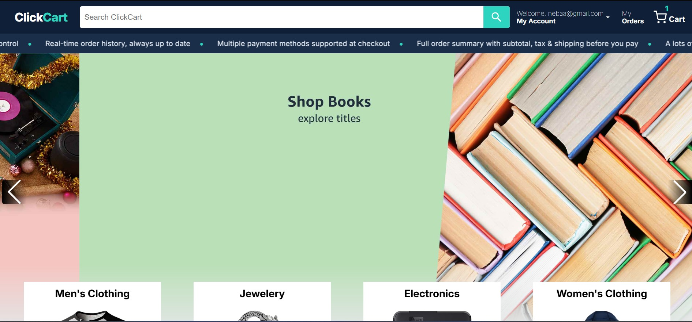
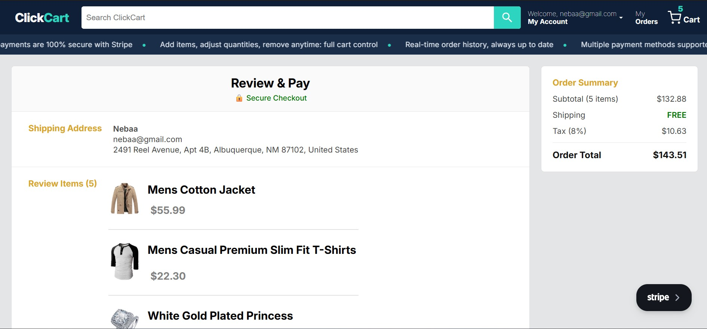
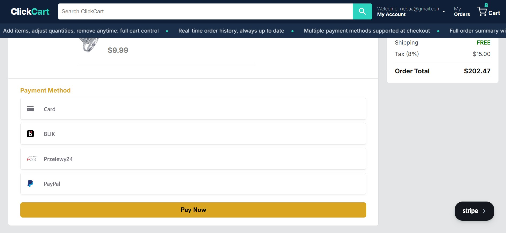

## ClickCart (Full-Stack E-commerce Web App)

A responsive full-stack e-commerce app with secure authentication, dynamic cart management, and integrated Stripe payments. Built using React, Express/Firebase, and modern deployment tools.

---

## Live URLs

- **Frontend (Vercel):** <a href="https://clickcart26.vercel.app" target="_blank" rel="noopener noreferrer">View Web App</a>
- **Backend (Render):** <a href="https://clickcart-a486.onrender.com" target="_blank" rel="noopener noreferrer">Express Server</a>

---

## Test Payment

You can try out the payment flow safely using Stripe’s **test mode**.

> **Note:** This is for demonstration purposes only. No real charges will occur.

### How to test:

1. Choose your preferred payment method.
2. Fill the required details.
3. Click the **Pay Now** button to complete the payment.
4. For some payment methods (e.g., PayPal, Google Pay), you may be redirected to an external Stripe page.
5. Follow the checkout instructions on the site.

#### Test Card (for card payment only)
> Use the following Stripe provided card details:

> **✅ Success**
> ```
> 4242 4242 4242 4242
> ```
>
> **❌ Declined**
> ```
> 4000 0000 0000 0002
> ```
>
> **🔐 3D Secure**
> ```
> 4000 0027 6000 3184
> ```

> Use any future expiration date and any CVC.


> All other payment methods in test mode can accept dummy details, you won’t be charged.

## Tech Stack

### Frontend

- React 19 + Vite
- React Router
- Material UI
- Firebase Authentication
- Stripe Payment Element
- CSS

### Backend (Two Options)

- **Option A:** Node.js + Express 5 (Render)
- **Option B:** Firebase Functions (Serverless)

### Services & APIs

- Stripe (Payments)
- Firebase Auth
- <a href="https://fakestoreapi.com" target="_blank" rel="noopener noreferrer">Fake Store API</a> (Product Data)

### Database

- Firestore (stores user orders and enables order history)

---

## Features

### Authentication

- User Sign Up / Sign In / Sign Out
- Password Reset (Forgot Password)
- Persistent login state using Context API

### Cart Management

- Add to cart
- Increase / decrease quantity
- Remove items from cart

### Payments (Stripe)

- Integrated Stripe Payment Element
- Supports multiple payment methods
- Secure payment processing using PaymentIntents

### Order Flow

- Order summary (subtotal, tax, shipping)
- Secure payment processing with Stripe
- Redirect to success page with payment status
- Orders stored in Firestore after successful payment
- Cart cleared only after successful order storage

### Orders & Persistence

- Real-time order history page showing items, totals, and status fetched from database(Firestore) including user's past orders if available.
- Orders sorted by latest (most recent first)

### Protected Routes

- Checkout/payment page is accessible only to registered users
- Orders page is restricted to logged-in users
- Unregistered users are redirected to login

### Shopping Experience

- Product listing (Fake Store API)
- Category browsing
- Product detail view

### UX Enhancements

- Loading states
- Toast notifications

---

## Screenshots

### Home Page



### Checkout



### Checkout / Payment

## 

## Run Locally

### 1. Clone Repository

```bash
git clone https://github.com/Nebiyu14/clickcart.git
cd clickcart
```

---

### 2. Backend Setup

#### Option A: Express Backend (Recommended)

```bash
cd backendExpress
npm install
```

Create `.env`:

```env
STRIPE_SECRET_KEY=sk_test_your_key_here
PORT=3000
```

Run server:

```bash
npm start
```

---

#### Option B: Firebase Functions

```bash
cd backendFirebase/functions
npm install
```

Create `.env`:

```env
STRIPE_SECRET_KEY=sk_test_your_key_here
```

Run emulator:

```bash
npm run serve
```

---

### 3. Frontend Setup

```bash
cd ClientSide
npm install
```

Create `.env`:

```env
VITE_STRIPE_PUBLIC_KEY=pk_test_your_key_here
VITE_FRONTEND_BASE_URL=http://localhost:5005
VITE_BACKEND_BASE_URL=http://localhost:3000
```

> If using Firebase Functions:

```env
VITE_BACKEND_BASE_URL=<your-project-id>/us-central1/api
```

Run frontend:

```bash
npm run dev
```

Open:

```
http://localhost:5005
```

---

## Project Structure

```
/ClientSide        → React frontend
/backendExpress    → Express backend
/backendFirebase   → Firebase Functions backend
```

---

---

## Show Your Support🙏

If you like this project, consider giving it a ⭐️ on GitHub. Thank you!

---

## Author

**Nebiyu T Nadew**

---
